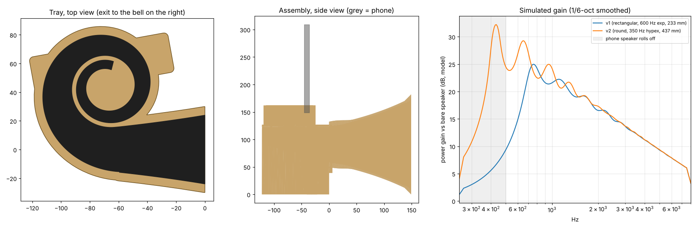

# Phone horn v2: the "snail"

A passive phone speaker built around a round bell and a coiled throat. The phone
stands speaker-down on top. The sound winds through a flat spiral under the
phone, then leaves through a round bell with a flanged, rolled mouth.

## What the research says

**Published measurements are thin.**
- One hands-on test of a commercial phone "amplifier" measured +1 dB at 250 Hz and about +3 dB at 1 kHz. Above 5 kHz it *lost* at least 5 dB, and the sound came out coloured ([TNT-Audio](https://www.tnt-audio.com/accessories/smartphone_booster_e.html)).
- Makers claim 6–12 dB, but without data ([Ampli-Phone](https://www.iphone-ticker.de/ampli-phone-passiver-iphone-lautsprecher-7540/), [Nokia patent US9183826](https://patents.google.com/patent/US9183826)).
- A University of Wisconsin study of 3D-printed phone amps targeted +10 dB in PLA ([Amplifi3D](https://additive-mfg.me.wisc.edu/?p=2401)).
- Takeaway: gain is strongly frequency-dependent, and a bad horn can make the sound worse.

**Horn engineering:**
- **Length and flare rate set how low the horn helps.** Mouth size and shape set how smooth the response is. A horn that's too short (like v1) does little below its cutoff. Forum summaries of Hornresp work back this up ([diyAudio](https://www.diyaudio.com/community/threads/hornresp.119854/page-89)).
- **Mouth shape matters.** Rolled-back or flanged mouths (Le Cléac'h / Kugelwellen style) reflect less sound back down the horn, so the response ripples less ([diyAudio, J-M Le Cléac'h](https://www.diyaudio.com/community/goto/post?id=2660241)).
- **Folding only costs treble if the channel is wide in the bend plane.** Trouble starts when that width reaches about half a wavelength (21 mm at 8 kHz, 48 mm at ~3.5 kHz). So fold while the channel is narrow, or make it tall and thin where it folds.
- **Stiffness:** thin printed PLA walls ring, and stiffness is the usual flaw in phone horns ([Midwest Audio](https://diy.midwestaudio.club/discussion/comment/63672/)).
- **Phone choice:** horns work best on phones whose speaker is clean to begin with ([diyAudio](https://www.diyaudio.com/community/threads/horn-for-iphone.402185/)).

## What I simulated

`../sim/hornsim.py` is a 1-D plane-wave horn model built from transfer matrices with baffled-piston mouth radiation. I checked it against the textbook result for an infinite exponential horn, and it matches to 3 decimal places.

`../sim/sweep.py` compares 90 combinations of flare frequency (300–600 Hz), hypex shape (T 0.5–1.0) and mouth size (120–180 mm).

| | v1 | v2 |
|---|---|---|
| Flare | exponential, 600 Hz | hypex T=0.7, 350 Hz |
| Path length | 233 mm | 437 mm |
| Mouth | 150 × 100 rectangle, square edge | Ø150 round + 12 mm roll into a flange |
| Gain 400–500 Hz (model) | ~5–9 dB | ~24–32 dB |
| Gain 1–8 kHz | same | same |

The gain figures are relative to the bare speaker at the same diaphragm motion. They're good for **comparing designs**, not as real dB you'll hear. Real gain will be lower because of leaks, the phone's own roll-off below ~500 Hz and room effects.

The model doesn't simulate bends, the 3-D modes inside the wide bell, or wall vibration. The design rules below cover those.

**Mouth size barely changed the model's result between 120 and 180 mm.** I chose Ø150, the largest that prints in one piece on a 220 mm bed with a flange.

## Why it looks like this

1. **Spiral instead of a long straight horn.** 437 mm straight would be a 45 cm trumpet. The first 300 mm coils 1.6 turns into a 12 cm footprint under the phone.
2. **Tall, narrow channel in the coil.** The in-plane width grows from 6 to 48 mm, and the height grows from 15 to 64 mm. Bends only hurt through the in-plane width, so this keeps the coil "acoustically narrow" while the area grows. The tightest bend is 1.4× the channel width.
3. **Round bell with a flanged roll-over.** The rectangular channel morphs into a circle over the first 45 mm of the bell (superellipse), then flares to Ø150 and rolls into a flat flange.
4. **Thick, stiff walls and solid mass.**
   - Spiral walls are 3.2 mm, the outer wall is 6 mm, and the bell wall is 4 mm.
   - The bell's 45° conical outer skirt stiffens it so it doesn't ring.
   - The tray under the spiral is filled with infill, so it's heavy and won't tip with a phone on top.
5. **Every part prints with no supports.**
   - The tray's channels are open on top, with vertical walls and upward-facing floors.
   - The lid is a flat plate.
   - The bell prints mouth-up, so its inside only ever widens and the outer skirt never exceeds 45°. I checked this numerically.

## Parts

| File | Size (mm) | Prints | ~PLA at 15% gyroid |
|---|---|---|---|
| `out/tray.stl` | 122 × 116 × 123 | base down | 242 g |
| `out/lid.stl` | 122 × 116 × 39 | plate down, slot up | 36 g |
| `out/bell.stl` | 182 × 182 × 149 | joint plate down, mouth up | 128 g |
| `out/assembled_preview.stl` | 271 × 182 × 182 | for viewing only | – |

**Total: ~406 g.** That's less than v1's ~600 g, despite almost twice the horn length.

Change any parameter at the top of `horn2.py` and run `python3 horn2.py`. The script also checks that each part fits the bed and that every mesh is watertight.

## G-code plan (Ender 3 Pro, PLA+): not sliced yet

Shared settings:
- **Layers and walls:** 0.2 mm layers, 4 walls, 5 top and 5 bottom layers.
- **Infill:** gyroid 15%. The tray's mass comes from its volume.
- **Supports:** off.
- **Temperature:** 205–215 °C nozzle, 60 °C bed (check your spool label).
- **Speed:** 50 mm/s; outer walls 30 mm/s; first layer 20 mm/s.

| Part | Adhesion | Notes | Rough time |
|---|---|---|---|
| Tray | 5 mm brim | Spiral walls are thin and tall (64 mm). Keep the fan at 100% after layer 3 and outer-wall speed low so they stay straight. | 16–20 h |
| Lid | skirt | Ironing on the top surface is optional. | 3 h |
| Bell | 8 mm brim | The base plate is small compared with the 182 mm flange above it. The brim and a level bed matter. | 12–15 h |

## Assembly

1. Sand the tray channels and the inside of the bell, especially the morph zone at the bell's base.
2. Cut 1.75 mm filament into dowels:
   - **Lid to tray:** 9 mm dowels in the outer-wall holes.
   - **Tray to bell:** 12 mm dowels in the two holes below the exit.
3. Glue the lid to the tray with CA or epoxy. Run a bead of glue around the top of every spiral wall first, so turns can't leak into each other. **This seal is the single biggest factor in performance.**
4. Glue the bell to the tray's exit face, then fill the joint seam inside with wood filler or glue and sand it smooth.
5. Put a foam gasket (3 mm weatherstrip) on the slot floor around the throat hole.
6. **On the phone:** turn on **Mono audio** (Samsung: Settings › Accessibility › Hearing enhancements). Stereo phones send half the music to the top earpiece speaker, and this horn only catches the bottom one. Volume around 80–90% keeps the micro-speaker out of distortion.

## Still needed before G-code

1. **Phone model**, or the grille's offset from the centre of the bottom edge (`SPEAKER_OFFSET`). The throat sits under the slot centre right now.
2. **Phone thickness in its case**, if it's over 12 mm.
3. **PLA+ temperature range** from the spool label.

## Test first (recommended)

Print **only the lid** (3 h) and check the phone fit and grille alignment. The lid holds all the phone-specific geometry, so it's the cheapest way to catch a slot or offset mistake before the 30+ hours of tray and bell.
